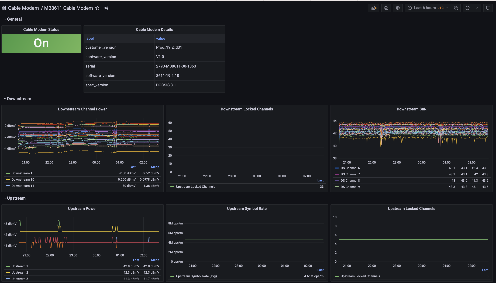

# mb8611-grafana-prometheus
Attempt at a Grafana dashboard for the Motorola MB8611 cable modem, using data provided by <a href="https://github.com/jahkeup/prometheus-moto-exporter">prometheus-moto-exporter<a/>. This dashboard is heavily inspired presentation wise by <a href="https://github.com/ickymettle/netgear_cm_exporter/blob/master/grafana/dashboard_screenshot.png">this screenshot</a> for <a href="https://github.com/ickymettle/netgear_cm_exporter">netgear_cm_exporter<a>.

# Prerequisits

This dashboard assumes you have installed/configured <a href="https://github.com/jahkeup/prometheus-moto-exporter">prometheus-moto-exporter<a/>, Prometheus, and Grafana.

In `prometheus.yml`, my configuration for prometheus-moto-exporer looks like:

```
  - job_name: 'mb8611'
    scrape_interval: 15s
    static_configs:
    - targets: ['<ipv4address>:9731']
```

With `<ipv4address>` being the IP and following that, the (hopefully correct) port # for prometheus-moto-exporter.

# Features
  
I tried my best to add any interesting info available from prometheus-moto-exporter, including:
  
- Cable modem connection status
- Basic info about the modem, such as serial # and firmware version
- Diagnostic information, such as # of locked channels, power, symbol rate, signal to noise, and error rates.
  
# Disclaimers

As hinted at above, I don't have experience interpreting cable modem related metrics, thus it is very possible I made mistakes on this dashboard. Apologies and kindly submit a PR if you have better suggestions, I'll happly accept.

Additionally, this dashboard only been tested with a Motorola MB8611 Cable Modem for approximately ~24 hours as of this writing.

Finally, please note that all data visualized in this dashboard comes from <a href="https://github.com/jahkeup/prometheus-moto-exporter">prometheus-moto-exporter<a/>. All this dashboard does is make it a lot easier to visualize / interpret.

# Screenshots
  
  
  
